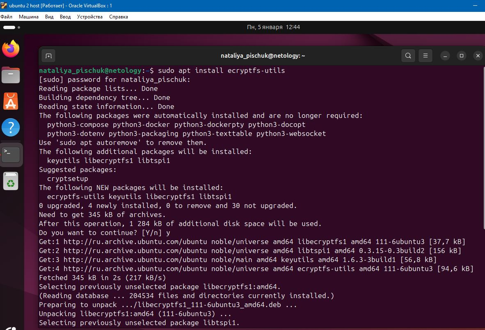
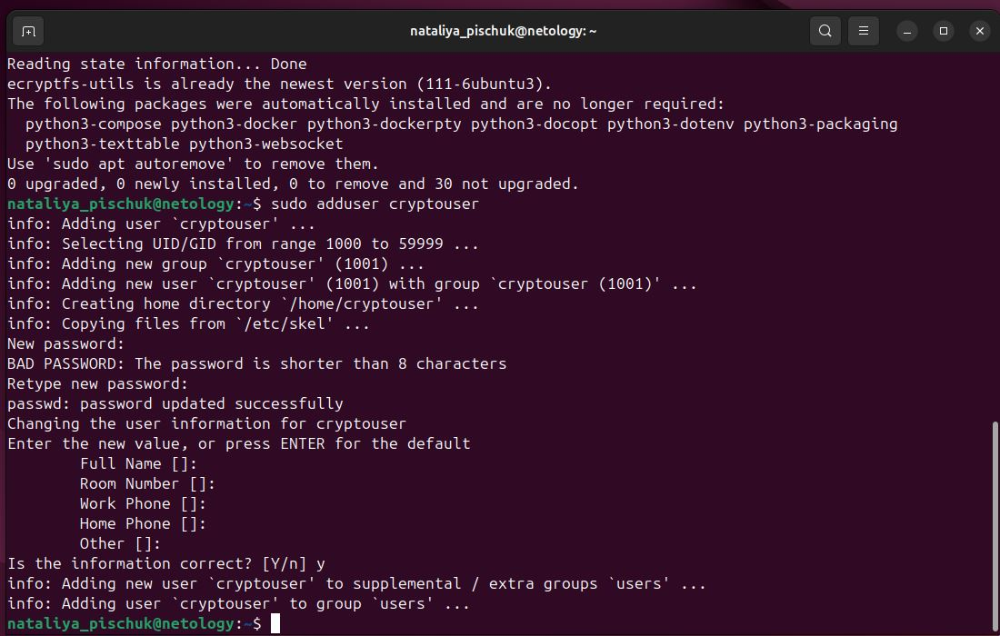
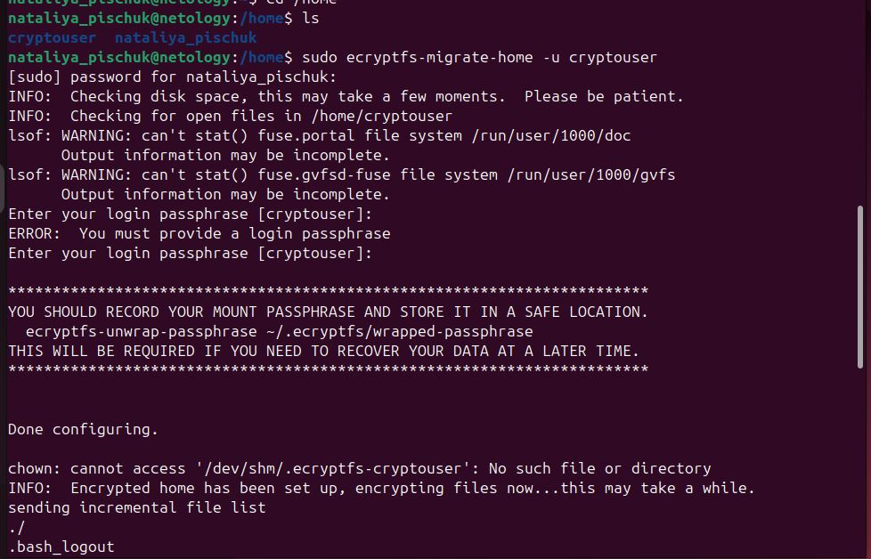
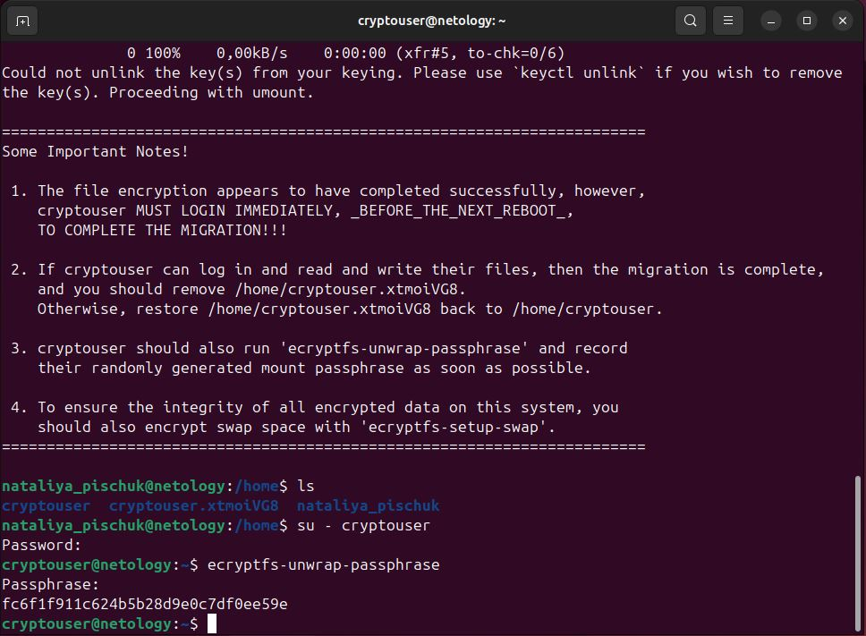
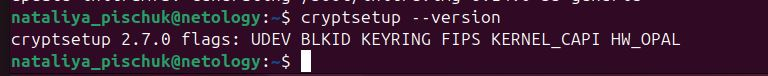
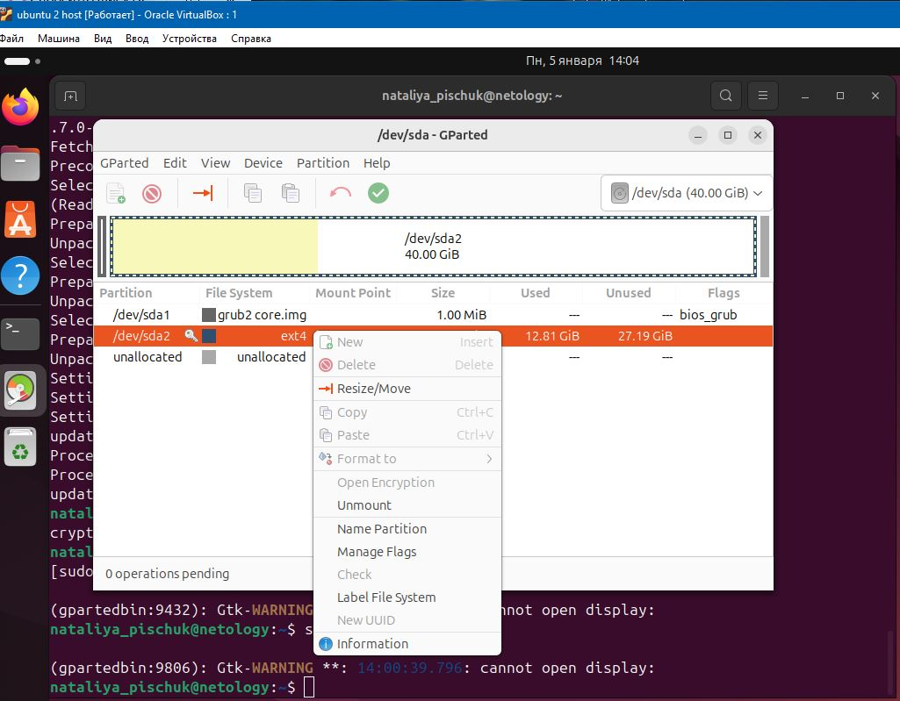
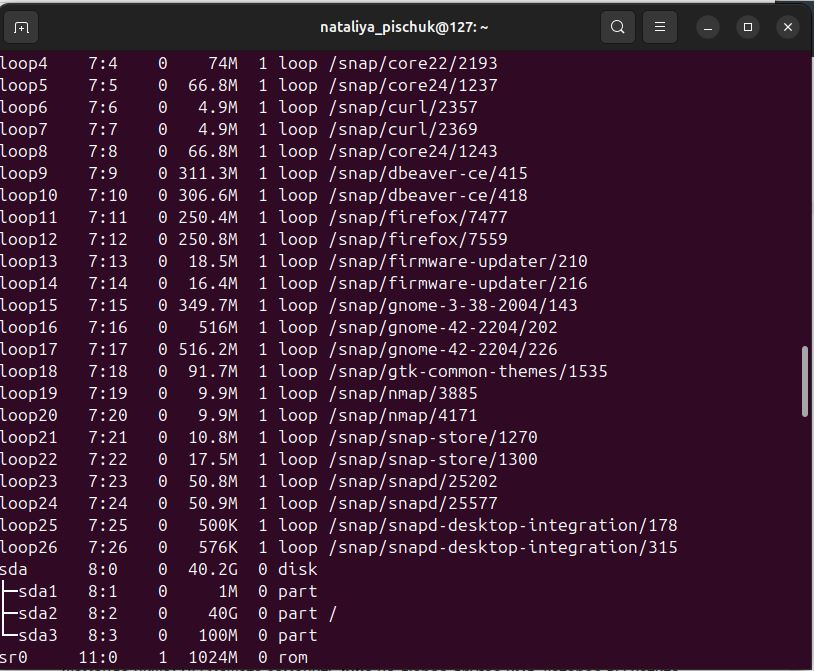

# Домашнее задание к занятию «Защита хоста»
## Задание 1
Установите eCryptfs.
Добавьте пользователя cryptouser.
Зашифруйте домашний каталог пользователя с помощью eCryptfs.
## Ответ
Был установлен пакет acryptfs-utils

Добавлен пользователь cryptouser и прописан в файле sudoers, а также созданы файлы в директории users

помощью команды sudo ecryptfs-migrate-home -u cryptouser зашифровала каталог пользователя

Результат и информация для восстановления

## Задание 2
- Установите поддержку LUKS.
- Создайте небольшой раздел, например, 100 Мб.
- Зашифруйте созданный раздел с помощью LUKS.
В качестве ответа пришлите снимки экрана с поэтапным выполнением задания.
## Ответ
Была установлена поддержка LUKS — пакет cryptsetup
#### sudo apt-get install cryptsetup

Дополнительно  подготовила диск. Так в у меня существовал только один раздел в Linux, который не подлежит изменению, я в VirtualBox через менеджер виртуальных носителей добавила дисковое пространство и потом уже через программу gparted сформировала нужный мне раздел
##### sudo apt install gparted

Зашифровала раздел sda3

sudo cryptsetup -y -v --type luks2 luksFormas /dev/sdb3 — сама шифровка

sudo cryptsetup luksDump /dev/sdb1 — для проверки шифрования

